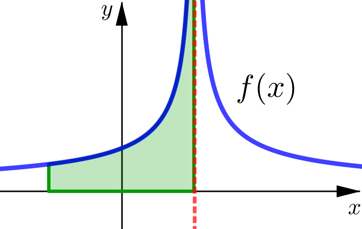
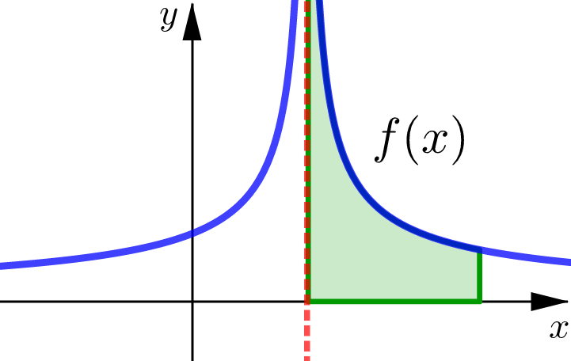
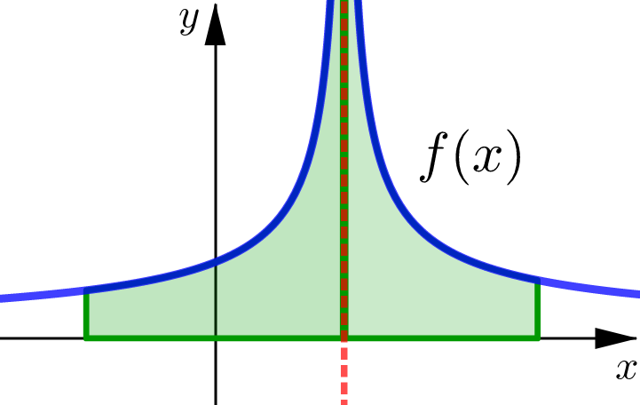

# (AI-5) Improper Integrals

In this lesson we are going to see how we can generalize our definition of the definite integral to include improper integrals:
- integrals over infinite intervals 
- integrals of functions with an infinite discontinuity

By the end of this lesson, you will be able to determine whether an improper integral is convergent or divergent, and if convergent, be able to evaluate the integral. 


---


## Fundamental Theorem of Calculus Part&nbsp;2

We begin by recalling the big one. The theorem that motivates most of what we do with integral calculus: 

```{admonition} Fundamental Theorem of Calculus Part 2
If $f$ is continuous on $[a,b]$ then:

$$
\int_a^b f(x)\, dx = F(b)-F(a)
$$

where $F$ is any antiderivative of $f$.
```

Notice that there are really two conditions for this theorem to hold:

1. The interval $[a,b]$ is finite.
2. Function $f$ is continuous on the interval.

If we relax either of these conditions we can get what are called **improper integrals.**


---


## (Right) Infinite Intervals


```{admonition} (Right Hand) Improper Integrals
If $f(x)$ is continuous for $x\geq a$ then,

$$
\int_a^{\infty} f(x)\, dx = \lim_{b\to\infty} \int_a^{b} f(x)\, dx
$$

```

We say that this improper integral is **convergent** if the limit exists. If the limit does not exist, then we say the improper integral is **divergent.** 

### Area Interpretation

For non-negative functions we interpret this improper integral as representing the **area under the curve** $y=f(x)$ for $x\geq a$.


---

## Example 1
Determine if the following improper integral is convergent or divergent. If convergent, find its value:

$$
\int_0^{\infty} e^{-2x}\, dx
$$


``````{dropdown} Solution (Click to see the steps.)


`````{tabbed} Step 1
We notice that we are attempting to integrate over infinite interval $[0,\infty)$, so we have an improper integral. 

This means we first need to use the definition and rewrite this integral as a limit:


$$
\int_0^{\infty} e^{-2x}\, dx = \lim_{b\to\infty} \int_0^{b} e^{-2x}\, dx 
$$

This is a crucial step. 

What we've done here is effectively separate the $\infty$ from our integration. The only way we can deal with $\infty$ is with limits, we need to approach it. We cannot just plug $\infty$ into a function because it is **not a number that we can evaluate.**


`````

`````{tabbed} Step 2
Next we work on calculating the resulting definite integral:

$$
\lim_{b\to\infty} \int_0^{b} e^{-2x}\, dx & = \lim_{b\to\infty} -\tfrac{1}{2} e^{-2x}\biggr|_{x=0}^{x=b}\\[10pt]
& = \lim_{b\to\infty} \bigg(\left(-\tfrac{1}{2} e^{-2b}\right)-\left(-\tfrac{1}{2} e^{0}\right)\bigg)\\[10pt]
& = \lim_{b\to\infty} \bigg(\tfrac{1}{2}-\tfrac{1}{2} e^{-2b}\bigg)\\[10pt]
$$


`````

`````{tabbed} Step 3
Finally, we calculate the limit at infinity (using all of our techniques we learned back in Calculus 1.) And to help with this we rewrite any negative exponents as fractions. This just helps us conceptually see what is happening with the limit.

$$
& = \lim_{b\to\infty} \bigg(\tfrac{1}{2}-\tfrac{1}{2} e^{-2b}\bigg)\\[10pt]
& = \lim_{b\to\infty} \bigg(\tfrac{1}{2}-\tfrac{1}{2} \cdot \dfrac{1}{e^{2b}}\bigg)\\[10pt]
& = \tfrac{1}{2}-\tfrac{1}{2} \cdot 0\\[10pt]
& = \tfrac{1}{2}
$$

```{admonition} Limit at Infinity
Note that  $\dfrac{1}{e^{2b}}$ is one of our $\dfrac{1}{\infty}$-forms and so:

$$
\lim_{b\to\infty} \dfrac{1}{e^{2b}}=0
$$
```


`````


`````{tabbed} Conclusion
We have shown that the improper integral

$$
\int_0^{\infty} e^{-2x}\, dx = \dfrac{1}{2}
$$

and is therefore **convergent.**

`````


`````{tabbed} Area
Since $f(x)=e^{-2x}$ is a non-negative function, what we have just shown is that the area of the region under this curve starting at $x=0$ and extending infinitely far to the right is finite and:

$$
\text{Area } =\tfrac{1}{2}
$$


`````


``````


## Example 2
Determine if the following improper integral is convergent or divergent. If convergent, find its value:

$$
\int_2^{\infty} \dfrac{1}{\sqrt{3x+5}}\, dx 
$$


``````{dropdown} Solution (Click to see the steps.)


`````{tabbed} Step 1
We notice that we are attempting to integrate over infinite interval $[2,\infty)$, so we have an improper integral. 

This means we first need to use the definition and rewrite this integral as a limit:


$$
\int_2^{\infty} \dfrac{1}{\sqrt{3x+5}}\, dx  = \lim_{b\to\infty} \int_2^{b} \dfrac{1}{\sqrt{3x+5}}\, dx 
$$

This is a crucial step. 

What we've done here is effectively separate the $\infty$ from our integration. The only way we can deal with $\infty$ is with limits, we need to approach it. We cannot just plug $\infty$ into a function because it is **not a number that we can evaluate.**


`````

`````{tabbed} Step 2
Next we work on calculating the resulting definite integral. Note that this is a $k$-form integral, so we can just do a mental $u$-substition.

$$
\lim_{b\to\infty} \int_2^{b} \dfrac{1}{\sqrt{3x+5}}\, dx & = \lim_{b\to\infty} \int_2^{b} (3x+5)^{-1/2}\, dx \\[10pt]
& = \lim_{b\to\infty} \tfrac{2}{3} (3x+5)^{1/2} \biggr|_{x=2}^{x=b}\\[10pt]
& = \lim_{b\to\infty} \bigg( \tfrac{2}{3} (3b+5)^{1/2}- \tfrac{2}{3} (11)^{1/2}\bigg)\\[10pt]
$$


`````

`````{tabbed} Step 3
Finally, we calculate the limit at infinity:

$$
\lim_{b\to\infty} \bigg( \tfrac{2}{3} (3b+5)^{1/2}- \tfrac{2}{3} (5)^{1/2}\bigg)= \infty
$$


```{admonition} Limit at Infinity
Note that  $(3b+5)^{1/2}$ is one of our $b^n$-forms and so:

$$
\lim_{b\to\infty} (3b+5)^{1/2}=\infty
$$
```


`````


`````{tabbed} Conclusion
We have shown that the improper integral

$$
\int_2^{\infty} \dfrac{1}{\sqrt{3x+5}}\, dx = \infty
$$

and is therefore **divergent.**

`````


`````{tabbed} Area
Since $f(x)= \tfrac{1}{\sqrt{3x+5}}$ is a non-negative function, what we have just shown is the area of the region under this curve starting at $x=2$ and extending infinitely far to the right is **infinite.**


`````


``````


---


## Infinite Intervals


### Improper Integrals


```{admonition} (Right Hand) Improper Integral
If $f(x)$ is continuous for $x\geq a$ then,

$$
\int_a^{\infty} f(x)\, dx = \lim_{b\to\infty} \int_a^{b} f(x)\, dx
$$

```


```{admonition} (Left Hand) Improper Integral
If $f(x)$ is continuous for $x\leq b$ then,

$$
\int_{-\infty}^{b} f(x)\, dx = \lim_{a\to-\infty} \int_a^{b} f(x)\, dx
$$

```


```{admonition} Improper Integral
If both left and right improper integrals are convergent then,

$$
\int_{-\infty}^{\infty} f(x)\, dx = \int_{-\infty}^{0} f(x)\, dx + \int_0^{\infty} f(x)\, dx
$$

(We can split this integral at any other $x$-value besides $x=0$.)

```

### Convergent and Divergent

In each of the left and right cases, we say that the improper integral is **convergent** if the limit exists. If the limit does not exist, then we say the improper integral is **divergent.** 

The improper integral over the interval $(-\infty,\infty)$ is:
1. **convergent** only if left and right improper integrals are both convergent. 
2. **divergent** if at least one of the left and right improper integrals is divergent. 

### Area Interpretation

For non-negative functions we interpret these improper integrals as representing the **area under the curve** $y=f(x)$ and above the $x$-axis.

```{panels}
(Left) Improper Integral
^^^


---
(Right) Improper Integral
^^^


```

```{panels}
Improper Integral
^^^


```

### Procedure

In general the steps for computing an improper integral are:

1. Rewrite the improper integral as a limit.
2. Integrate $\displaystyle \int_a^b f(x)\, dx$ like usual.
3. Calculate the limit.


## Important Limits at Infinity

### $1/\infty$-forms

```{panels}
Power Functions
^^^
$$
\lim_{x\to \infty} \dfrac{1}{x^n}&=0\\[10pt]
\lim_{x\to -\infty} \dfrac{1}{x^n}&=0\\[10pt]
$$

---

Transcendental Functions
^^^
$$
\lim_{x\to \infty} \dfrac{1}{e^x}&=0\\[10pt]
\lim_{x\to -\infty} e^x&=0\\[10pt]
$$


```

### Infinite Limits

```{panels}
Power Functions
^^^
$$
\lim_{x\to \infty} x^n&=\infty\\[10pt]
\lim_{x\to -\infty} x^n&=\pm\infty\\[10pt]
$$

---

Transcendental Functions
^^^
$$
\lim_{x\to \infty} e^{x}&=\infty\\[10pt]
\lim_{x\to \infty} \ln x &=\infty\\[10pt]
$$


```


### Special Cases

```{panels}
Inverse Tangent
^^^
$$
\lim_{x\to \infty} \tan^{-1}x&=\dfrac{\pi}{2}\\[10pt]
\lim_{x\to -\infty} \tan^{-1}x&=-\dfrac{\pi}{2}\\[10pt]
$$

---

All Trig Functions
^^^
$$
\lim_{x\to \infty} trig(x)&=\text{DNE}\\[10pt]
\lim_{x\to -\infty} trig(x)&=\text{DNE}\\[10pt]
$$


```


## Example 3
Determine if the following improper integral is convergent or divergent. If convergent, find its value:

$$
\int_{-\infty}^{\infty} \dfrac{1}{1+x^2}\, dx 
$$


``````{dropdown} Solution (Click to see the steps.)


`````{tabbed} Step 1
We begin by splitting this improper integral into the left and right improper integrals:

$$
\int_{-\infty}^{\infty} \dfrac{1}{1+x^2}\, dx =  \int_{-\infty}^{0} \dfrac{1}{1+x^2}\, dx + \int_0^{\infty} \dfrac{1}{1+x^2}\, dx
$$


`````

`````{tabbed} Step 2
Let's calculate the right improper integral first:

$$
\int_0^{\infty} \dfrac{1}{1+x^2}\, dx & = \lim_{b\to\infty} \int_0^{b} \dfrac{1}{1+x^2}\, dx \\[10pt]
& = \lim_{b\to\infty} \tan^{-1}x \biggr|_{x=0}^{x=b} \\[10pt]
& = \lim_{b\to\infty} \bigg(  \tan^{-1} b -  \tan^{-1} 0\bigg)\\[10pt]
& = \lim_{b\to\infty}  \tan^{-1} b \\[10pt]
& = \dfrac{\pi}{2} \\[10pt]
$$

Since we get a number as our result here, it means the right improper integral is convergent.

This tells us to keep going with our calculation of the left improper integral. If instead we had found the right improper integral was divergent we could stop, the entire improper integral would automatically be divergent then as well.

`````

`````{tabbed} Step 3
Let's calculate the left improper integral next:

$$
\int_{-\infty}^0 \dfrac{1}{1+x^2}\, dx
& = \lim_{a\to-\infty} \int_a^{0} \dfrac{1}{1+x^2}\, dx \\[10pt]
& = \lim_{a\to-\infty}  \tan^{-1}x \biggr|_{x=a}^{x=0} \\[10pt]
& = \lim_{a\to-\infty} \bigg(  \tan^{-1} 0 -  \tan^{-1} a\bigg)\\[10pt]
& = \lim_{a\to-\infty}  -\tan^{-1} a \\[10pt]
& = -\left(-\dfrac{\pi}{2}\right) \\[10pt]
& = \dfrac{\pi}{2} \\[10pt]
$$

And again, since we found a numerical value here, this improper integral is convergent.


`````


`````{tabbed} Conclusion
Since both the left and right improper integrals are convergent, we conclude that our original improper integral is convergent as well.

Additionally, the value of the integral is:

$$
\int_{-\infty}^{\infty} \dfrac{1}{1+x^2}\, dx &=  \int_{-\infty}^{0} \dfrac{1}{1+x^2}\, dx + \int_0^{\infty} \dfrac{1}{1+x^2}\, dx \\[10pt]
& = \dfrac{\pi}{2} + \dfrac{\pi}{2} \\[10pt]
& = \pi
$$


`````


`````{tabbed} Area
Since $f(x)= \tfrac{1}{1+x^2}$ is a non-negative function, the entire region under this curve has a finite area with:


$$
\text{Area } =\pi
$$


`````


``````


## Example 4
Determine if the following improper integral is convergent or divergent. If convergent, find its value:

$$
\int_{1}^{\infty} xe^{-3x}\, dx 
$$


``````{dropdown} Solution (Click to see the steps.)


`````{tabbed} Step 1
We start by writing the improper integral as a limit:

$$
\int_{1}^{\infty} xe^{-3x}\, dx  = \lim_{b\to\infty} \int_{1}^{b} xe^{-3x}\, dx 
$$


`````

`````{tabbed} Step 2
Next let's calculate the resulting definite integral, which will require integration by parts.

We pick $u=x$ and $dv=e^{-3x}\, dx$ to get:

$$
\int_{1}^{b} xe^{-3x}\, dx  & = \bigg[-\tfrac{1}{3}xe^{-3x}+\tfrac{1}{3}\int e^{-3x}\, dx\bigg]_{x=1}^{x=b} \\[10pt]
& = \bigg[-\tfrac{1}{3}xe^{-3x}-\tfrac{1}{9} e^{-3x}\bigg]_{x=1}^{x=b} \\[10pt]
& = \bigg[\left(-\tfrac{1}{3}e^{-3x}\right)\left(x+\tfrac{1}{3}\right)\bigg]_{x=1}^{x=b} \\[10pt]
& = \left(-\tfrac{1}{3}e^{-3b}\right)\left(b+\tfrac{1}{3}\right)- \left(-\tfrac{1}{3}e^{-3}\right)\tfrac{4}{3}\\[10pt]
& = -\tfrac{1}{3}e^{-3b}\left(b+\tfrac{1}{3}\right)+\tfrac{4}{9}e^{-3}\\[10pt]
& = \tfrac{4}{9}e^{-3}-\tfrac{1}{3}e^{-3b}\left(b+\tfrac{1}{3}\right)\\[10pt]
$$


`````

`````{tabbed} Step 3
Putting this result in and then noting the limit of a constant is just the same constant we get:

$$
\int_{1}^{\infty} xe^{-3x}\, dx  &= \lim_{b\to\infty} \int_{1}^{b} xe^{-3x}\, dx \\[10pt]
& = \lim_{b\to\infty} \bigg(\tfrac{4}{9}e^{-3}-\tfrac{1}{3}e^{-3b}\left(b+\tfrac{1}{3}\right)\bigg)\\[10pt]
& =\tfrac{4}{9}e^{-3}-\tfrac{1}{3}\lim_{b\to\infty} e^{-3b}\left(b+\tfrac{1}{3}\right)\\[10pt]
$$

We see that the remaining limit is an **indeterminate product** of the form $0\cdot \infty$. We need to first rewrite this as a indeterminate quotient and then use L'Hospital's Rule:

$$
\lim_{b\to\infty} e^{-3b}\left(b+\tfrac{1}{3}\right) & = \lim_{b\to\infty} \dfrac{1}{e^{3b}}\cdot\left(b+\tfrac{1}{3}\right)\\[10pt]
& = \lim_{b\to\infty} \dfrac{b+\tfrac{1}{3}}{e^{3b}}\\[10pt]
& \stackrel{H}{=} \lim_{b\to\infty} \dfrac{\left[b+\tfrac{1}{3}\right]'}{\left[e^{3b}\right]'}\\[10pt]
& = \lim_{b\to\infty} \dfrac{1}{3e^{3b}}\\[10pt]
$$

We were able use L'Hospital's Rule here since the resulting quotient was an indeterminate: $\dfrac{\infty}{\infty}$-form.

And then finally we have one of our $\tfrac{1}{\infty}$-forms:

$$
 \lim_{b\to\infty} \dfrac{1}{3e^{3b}} = 0
$$


`````


`````{tabbed} Conclusion
To summarize, we found:


$$
\int_{1}^{\infty} xe^{-3x}\, dx  &= \lim_{b\to\infty} \int_{1}^{b} xe^{-3x}\, dx \\[10pt]
& = \lim_{b\to\infty} \bigg(\tfrac{4}{9}e^{-3}-\tfrac{1}{3}e^{-3b}\left(b+\tfrac{1}{3}\right)\bigg)\\[10pt]
& = \tfrac{4}{9}e^{-3}-\tfrac{1}{3}\lim_{b\to\infty} e^{-3b}\left(b+\tfrac{1}{3}\right)\\[10pt]
& =\tfrac{4}{9}e^{-3}-\tfrac{1}{3}\cdot 0\\[10pt]
& =\tfrac{4}{9}e^{-3}\\[10pt]
$$

And so this improper integral is convergent with value: $\tfrac{4}{9}e^{-3}$.

`````


``````

```{warning}
In Example 4, we see:

- an integral requiring one of our advanced integration techniques (integration by parts)
- a limit that is an indeterminate form and ultimately requires L'Hospital's Rule


```

## Discontinuous Functions

One other type of improper integral occurs when the function we are integrating has a discontinuity somewhere in the interval $[a,b]$. This could happen at:
- one of the endpoints, $\quad x=a\quad$ or $\quad x=b$
- some number $c$ in the middle, $\quad a < c < b$

What are some of the discontinuities we might encounter?

- jump discontinuities
- removable discontinuities
- infinite discontinuities

### Improper Integrals


```{admonition} (Right Hand) Improper Integral
If $f$ is continuous on $(a,b]$ and discontinuous at $a$, then

$$
\int_a^{b} f(x)\, dx = \lim_{t\to a^+} \int_t^{b} f(x)\, dx
$$

```


```{admonition} (Left Hand) Improper Integral
If $f$ is continuous on $[a,b)$ and discontinuous at $b$, then

$$
\int_a^{b} f(x)\, dx = \lim_{t\to b^-} \int_a^{t} f(x)\, dx
$$

```


```{admonition} Improper Integral
If $f$ is discontinuous at $x=c$ where $a<c<b$ and both left and right improper integrals are convergent, then:

$$
\int_{a}^{b} f(x)\, dx = \int_a^{c} f(x)\, dx +\int_c^{b} f(x)\, dx 
$$

(We need to split this integral at the discontinuity $x=c$.)

```

### Convergent and Divergent

In each of the left and right cases, we say that the improper integral is **convergent** if the limit exists. If the limit does not exist, then we say the improper integral is **divergent.** 

The improper integral over the interval $[a,b]$ with a discontinuity somewhere in the middle at $x=c$ is:
1. **convergent** only if left and right improper integrals are both convergent. 
2. **divergent** if at least one of the left and right improper integrals is divergent. 

### Area Interpretation

For non-negative functions we interpret these improper integrals as representing the **area under the curve** $y=f(x)$ and above the $x$-axis.

```{panels}
(Left) Improper Integral
^^^


---
(Right) Improper Integral
^^^


```

```{panels}
Improper Integral
^^^



```


## Important Infinite Limits

### $c/0$-forms

These occur when we have division in our function. So we will always be on the look out now, for where our denominator is equal to 0. Note that these types can occur with:
- **power functions** where division is explicitly written e.g. $\dfrac{1}{x-5}$
- **trigonometric functions** where the division is a bit more subtle e.g. $\tan x = \dfrac{\sin x}{\cos x}$

```{panels}
Step 1
^^^
Identify that you have a $c/0$-form:

- non-zero number in the numerator
- zero in the denominator 

---

Step 2
^^^
Use a test number to decide if the limit is 

$$
+\infty \text{ or }-\infty
$$

(You need to test the left and right sides separately.)

```


### Special Cases

```{panels}
Logarithmic Functions
^^^
$$
\lim_{x\to 0^+} \ln x=-\infty
$$

---

Trigonometric Functions
^^^

$$
\tan x \qquad &\sec x \\[5pt]
\cot x \qquad &\csc x \\[5pt]
$$

all have infinite limits

```


## Example 5
Determine if the following improper integral is convergent or divergent. If convergent, find its value:

$$
\int_{1}^{4} \dfrac{1}{\sqrt{x-1}}\, dx 
$$


``````{dropdown} Solution (Click to see the steps.)


`````{tabbed} Step 0
The function we are integrating is undefined at the endpoint $x=1$. We can actually say a bit more: it has an infinite limit at $x=1$.


We know this, because at $x=1$ the numerator of our function is a non-zero number but the denominator is zero. This means we have one of our $\tfrac{c}{0}$-forms and can use a test number (maybe $t=1.1$) to find:

$$
\lim_{a\to1^{+}} \dfrac{1}{\sqrt{x-1}} = \infty
$$


`````

`````{tabbed} Step 1
We start by writing the improper integral as a limit:

$$
\int_{1}^{4} \dfrac{1}{\sqrt{x-1}}\, dx    = \lim_{a\to 1^{+}} \int_{a}^{4} \dfrac{1}{\sqrt{x-1}}\, dx 
$$


`````


`````{tabbed} Step 2
Next we work on calculating the resulting definite integral:

$$
  & \lim_{a\to 1^{+}} \int_{a}^{4} \dfrac{1}{\sqrt{x-1}}\, dx\\[10pt]
= & \lim_{a\to 1^{+}} \int_{a}^{4} (x-1)^{-1/2} \, dx \\[10pt]
= & \lim_{a\to 1^{+}} 2(x-1)^{1/2} \biggr|_{x=a}^{x=4}\\[10pt]
= & \lim_{a\to 1^{+}} \bigg(2(4-1)^{1/2}-2(a-1)^{1/2}\bigg)\\[10pt]
= & \lim_{a\to 1^{+}} \bigg(2\sqrt{3}-2(a-1)^{1/2}\bigg)\\[10pt]
$$


`````

`````{tabbed} Step 3
Finally, we calculate the limit (using all of our techniques we learned back in Calculus 1.)

$$
\lim_{a\to 1^{+}} \bigg(2\sqrt{3}-2(a-1)^{1/2}\bigg) &= 2\sqrt{3}-2(1-1)^{1/2} \\[10pt]
&= 2\sqrt{3} \\[10pt]
$$

Why? 

Since the function $(a-1)^{1/2}$ is defined and continuous at $a=1$, we can calculate this limit by directly plugging $a=1$ into the expression.


`````


`````{tabbed} Conclusion
We have shown that the improper integral

$$
\int_{1}^{4} \dfrac{1}{\sqrt{x-1}}\, dx   = 2\sqrt{3}
$$

and is therefore **convergent.**

`````


``````


## Example 6

Determine if the following improper integral is convergent or divergent. If convergent, find its value:

$$
\int_{0}^{7} \dfrac{1}{x-5}\, dx 
$$


``````{dropdown} Solution (Click to see the steps.)


`````{tabbed} Step 0
The function we are integrating is undefined at $x=5$ which occurs inside the interval $[0,7]$. We can actually say a bit more: it has an infinite limit at $x=5$.


We know this, because at $x=5$ the numerator of our function is a non-zero number but the denominator is zero. This means we have one of our $\tfrac{c}{0}$-forms and can use test numbers to find that:

$$
\lim_{b\to5^{-}} \dfrac{1}{x-5} &= -\infty\\[10pt]
\lim_{b\to5^{+}} \dfrac{1}{x-5} &= \infty\\[10pt]
$$


`````


`````{tabbed} Step 1
Since the infinite discontinuity occurs inside the interval $[0,7]$ we start by splitting up the integral into left and right improper integrals based on this discontinuity:

$$
\int_{0}^{7} \dfrac{1}{x-5}\, dx   = \int_{0}^{5} \dfrac{1}{x-5}\, dx  + \int_{5}^{7} \dfrac{1}{x-5}\, dx 
$$


In order for our original improper integral to be convergent, both the left and right improper integrals need to be convergent. This means we need to calculate each of these separately.

Let's start with the left improper integral:

$$
\int_{0}^{5} \dfrac{1}{x-5}\, dx 
$$

`````


`````{tabbed} Step 2
We start calculating the left improper integral by writing it as a limit:

$$
\int_{0}^{5} \dfrac{1}{x-5}\, dx   = \lim_{b\to5^{-}} \int_{0}^{b} \dfrac{1}{x-5}\, dx 
$$


`````


`````{tabbed} Step 3
Next we work on calculating the resulting definite integral:

$$
\lim_{b\to5^{-}} \int_{0}^{b} \dfrac{1}{x-5}\, dx  & = \lim_{b\to5^{-}} \ln|x-5| \biggr|_{x=0}^{x=b}\\[10pt]
& = \lim_{b\to5^{-}} \bigg(\ln|b-5|-\ln|0-5|\bigg)\\[10pt]
& = \lim_{b\to5^{-}} \bigg(\ln|b-5|-\ln 5\bigg)\\[10pt]
$$


`````

`````{tabbed} Step 4
Finally, we calculate the limit (using all of our techniques we learned back in Calculus 1.)

$$
\lim_{b\to5^{-}} \bigg(\ln|b-5|-\ln 5\bigg)= -\infty
$$

Why? 

As $b\to 5^{-}$, the term inside the log function $|x-5|\to 0^{+}$ and we know that whenever the term inside the log function approaches $0$ from the right, the output of the log function approaches $-\infty$. More explicitly:

$$
\lim_{x\to 0^{+}} \ln x = -\infty
$$


`````


`````{tabbed} Conclusion
We have shown that the left improper integral

$$
\int_{0}^{5} \dfrac{1}{x-5}\, dx  = -\infty
$$

and is therefore **divergent.**


This automatically means that our original improper integral is **divergent** as well. So without needing to calculate the right improper integral, we can conclude that 

$$
\int_{0}^{7} \dfrac{1}{x-5}\, dx 
$$

is divergent.


`````


``````


