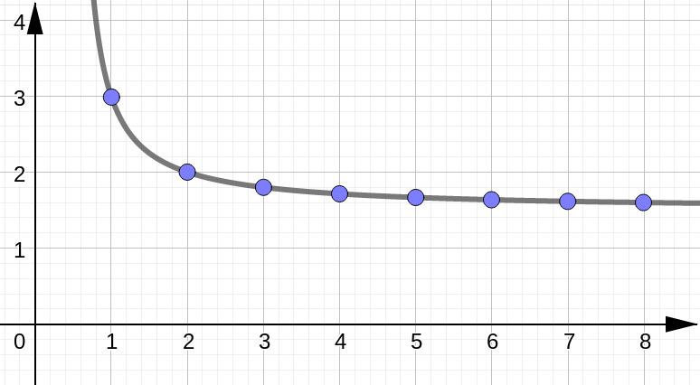
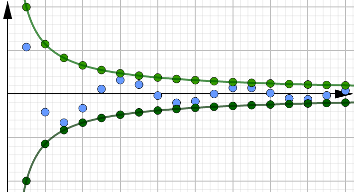

# (S-2) Limits of Sequences

In this lesson we are going to see how to calculate the limit of a sequence and ultimately determine whether the sequence is convergent or divergent.


---


## Definition of Limit


```{admonition} Limit of a Sequence 
The **limit of a sequence** is the number $L$ such that when we make $n$ sufficiently large positive, the terms of our sequence $a_n$ become very close to this number $L$. We write:

$$
\lim_{n\to \infty} a_n = L
$$

- **Converges:** the sequence is convergent if this limit exists.
- **Diverges:** the sequence is divergent if this limit does not exist.

```

### Graphical Representation


## Limit Laws

If $\{a_n\}$ and $\{b_n\}$ are convergent sequences, then:

```{panels}
Constants
^^^
$$
\lim_{n\to\infty} c & = c \\[10pt]
\lim_{n\to\infty} c\cdot a_n & = c\cdot \lim_{n\to\infty} a_n \\[10pt]
(*)\quad \lim_{n\to\infty} \big( a_n \big)^p & = \bigg(\lim_{n\to\infty} a_n \bigg)^p 
$$

---

Arithmetic
^^^
$$
\lim_{n\to\infty} \big(a_n+b_n \big) & = \lim_{n\to\infty} a_n + \lim_{n\to\infty} b_n \\[10pt]
\lim_{n\to\infty} \big(a_n-b_n \big) & = \lim_{n\to\infty} a_n - \lim_{n\to\infty} b_n \\[10pt]
\lim_{n\to\infty} \big(a_n\cdot b_n \big) & = \lim_{n\to\infty} a_n \cdot \lim_{n\to\infty} b_n \\[10pt]
(*)\quad  \lim_{n\to\infty} \dfrac{a_n}{b_n} & = \dfrac{\displaystyle \lim_{n\to\infty} a_n}{\displaystyle \lim_{n\to\infty} b_n} \\[10pt]
$$


```

**Disclaimer:** Two of the above limits laws have some extra conditions.
- For the power function property, we additionally require $p>0$ and $a_n>0$
- For the quotient property, we additionally require $\displaystyle \lim_{n\to\infty}b_n \neq 0$.


---


## Example 1


Calculate the following limit:

```{math}
\lim_{n\to\infty}\dfrac{3n}{2n-1}
```

````{dropdown} Solution (Click to see the steps.)


For limits at infinity like this, we start with our $\tfrac{1}{n}$-method: 
- Identify the largest power of $n$ in the denominator.
- Divide each term in the numerator and the denominator by this largest power.

$$
\lim_{n\to\infty}\dfrac{3n}{2n-1} &= \lim_{n\to\infty}\dfrac{3n}{2n-1}\cdot \dfrac{\tfrac{1}{n}}{\tfrac{1}{n}}\\[10pt]
&= \lim_{n\to\infty}\dfrac{\tfrac{3n}{n}}{\tfrac{2n}{n}-\tfrac{1}{n}}\\[10pt]
&= \lim_{n\to\infty}\dfrac{3}{2-\tfrac{1}{n}}\\[10pt]
$$

Use the limit laws:

$$
= \dfrac{\displaystyle \lim_{n\to\infty}3}{\displaystyle \lim_{n\to\infty}2-\lim_{n\to\infty}\tfrac{1}{n}}= \dfrac{3}{2-0}= \dfrac{3}{2}\
$$

And there we have it!

One thing to notice is that the limit of $\tfrac{1}{n}$ is one of our $\tfrac{1}{\infty}$-forms and so goes to $0$.

````

---

## Real Variable Functions

There is a result that allows us to use all of the techniques for calculating limits at infinity that we developed back when we were talking about real variable functions:


```{admonition} Theorem
Given sequence $\{a_n\}$, suppose $a_n=f(n)$ for some real variable function&nbsp;$f$.

$$
\text{If} \quad \lim_{x\to\infty} f(x) = L \quad \text{then} \quad \lim_{n\to\infty} a_n = L
$$

```





### Special Case

```{admonition} Important Limit
For $r>0$ we have: $\displaystyle \lim_{n\to\infty} \dfrac{1}{n^r} = 0 $
```

To prove this, we need to relate this sequence to a real variable function: 

$$
a_n = \dfrac{1}{n^r} \qquad \longrightarrow \qquad f(x)=\dfrac{1}{x^r}
$$

And then we consider the limit of this real variable function instead:

$$
\lim_{n\to\infty} \dfrac{1}{n^r} = \lim_{x\to\infty} \dfrac{1}{x^r} =0
$$


### L'Hospital's Rule

```{note}
If we can relate our sequence back to a real variable function, then we can use L'Hospital's Rule to help calculate limits, where applicable.
```


## Example 2


Calculate the following limit:

```{math}
\lim_{n\to\infty}\dfrac{2n}{e^n}
```

````{dropdown} Solution (Click to see the steps.)


We notice that this is one of our $\tfrac{\infty}{\infty}$ indeterminate forms, so we want to use L'Hospital's Rule. 

First we need to relate this sequence to a real variable function: 

$$
a_n = \dfrac{2n}{e^n} \qquad \longrightarrow \qquad f(x)=\dfrac{2x}{e^x}
$$

We consider the limit of this function instead:

$$
\lim_{n\to\infty}\dfrac{2n}{e^n} = \lim_{x\to\infty}\dfrac{2x}{e^x} \stackrel{H}{=} \lim_{x\to\infty}\dfrac{\big[2x\big]'}{\big[e^x\big]'} = \lim_{x\to\infty}\dfrac{2}{e^x} =0
$$


And there we go! We see that the limit of our sequence is 0 (that final limit is a $\tfrac{c}{\infty}$-form and so goes to $0$).


````


## Continuity

As we have seen back in Calculus 1, continuous functions behave very nicely with limits.


```{admonition} Theorem
If $f$ is continuous at $x=L$ and $\displaystyle \lim_{n\to\infty} a_n=L$, then

$$
\lim_{n\to\infty} f(a_n)= f(L)
$$

```

This result says that when we have a continuous outer function, we can essentially bring the limit inside this outer function and calculate the limit of the terms inside (provided their limit exists).


## Example 3

Calculate the following limit:

```{math}
\lim_{n\to\infty}\ln \left(2+\dfrac{3}{n}+\dfrac{5}{n^2}\right)
```

````{dropdown} Solution (Click to see the steps.)

We begin by observing that the sequence consists of a continuous outer function $ln (\cdot)$ and some inner terms. We can apply our previous theorem as long we find the limit of those inner terms exists and $\ln(L)$ is defined.

$$
\lim_{n\to\infty}\ln \left(2+\dfrac{3}{n}+\dfrac{5}{n^2}\right) &= \ln \left(\lim_{n\to\infty} \left(2+\dfrac{3}{n}+\dfrac{5}{n^2}\right)\right) \\[10pt]
&= \ln \left(\lim_{n\to\infty}2+\lim_{n\to\infty}\dfrac{3}{n}+\lim_{n\to\infty}\dfrac{5}{n^2}\right) \\[10pt]
&= \ln \left(2+0+0\right) \\[10pt]
&= \ln 2 \\[10pt]
$$

And since $\ln 2$ is defined, we can conclude this is ultimately the value of our limit.

````


## Example 4

Calculate the following limit:

```{math}
\lim_{n\to\infty}\dfrac{n^3}{\sqrt{n+5}}
```

````{dropdown} Solution (Click to see the steps.)

```{tabbed} Highest Power
We begin by using our usual strategy of dividing each term by the highest power of $n$ from the denominator. Doing this we get:

$$
\lim_{n\to\infty}\dfrac{n^3}{\sqrt{n+5}} &= \lim_{n\to\infty}\dfrac{\tfrac{n^3}{\sqrt{n}}}{\sqrt{\tfrac{n}{n}+\tfrac{5}{n}}}\\[10pt]
&= \lim_{n\to\infty}\dfrac{n^{5/2}}{\sqrt{1+\tfrac{5}{n}}}\\[10pt]
$$

We next look at what the denominator and numerator are doing separately as $n$ goes to infinity.

```


```{tabbed} Denominator

If we consider the limit of the denominator, we see:

$$
\lim_{n\to\infty}\sqrt{1+\tfrac{5}{n}} = \sqrt{\lim_{n\to\infty}\left(1+\tfrac{5}{n}\right)} = \sqrt{1+0}=1
$$

We're using the continuity of the square root function here to bring the limit inside.

```


```{tabbed} Numerator

Next we consider the limit of the numerator. 

Here we see that as $n$ gets large positive, so does $n^{5/2}$. This means we have an infinite limit and we write:


$$
\lim_{n\to\infty}n^{5/2} = \infty
$$

(If the term was becoming large negative, we would write&nbsp;$-\infty$.)

```


```{tabbed} Answer
Going back to the limit:

$$
\lim_{n\to\infty}\dfrac{n^{5/2}}{\sqrt{1+\tfrac{5}{n}}}
$$

We see that we have a numerator which is getting large positive and a denominator that is approaching the constant 1. This means the overall fraction must be getting large positive as well and so, goes to infinity. 

Therefore we have:

$$
\lim_{n\to\infty}\dfrac{n^3}{\sqrt{n+5}} = \lim_{n\to\infty}\dfrac{n^{5/2}}{\sqrt{1+\tfrac{5}{n}}}= \infty
$$


```

````

## Squeeze Theorem


```{admonition} Squeeze Theorem 
Given sequences such that $a_n\leq b_n \leq c_n$ eventually holds for all $n$.  

If $\displaystyle \lim_{n\to\infty} a_n=L=\displaystyle \lim_{n\to\infty} c_n$, then

$$
\lim_{n\to\infty} b_n= L
$$

```

````{dropdown} Motivation for Proof

To see why this might be true, start with the inequality and apply the limit to all sides:

$$
a_n& \leq \quad b_n &\leq c_n \\[10pt]
\lim_{n\to\infty} a_n & \leq \lim_{n\to\infty} b_n &\leq \lim_{n\to\infty} c_n \\[10pt]
L & \leq \lim_{n\to\infty} b_n &\leq L \\[10pt]
$$

The only way for that last inequality to be true is if 

$$
\lim_{n\to\infty} b_n = L 
$$

````


## Example 5 

Calculate the following limit:

```{math}
\lim_{n\to\infty}\dfrac{\cos n}{n^2}
```

````{dropdown} Solution (Click to see the steps.)

```{tabbed} Tricky Term

Let's begin by considering the term $\cos n$. 

On its own, this term is divergent because it oscillates back and forth without ever approaching one specific number. This term is also difficult to work with because the values of the sequence do not fit a nice pattern (other than being points on the cosine curve).  

It would be helpful if we could somehow consider an easier sequence, and this is where the Squeeze Theorem comes in.

```

```{tabbed} Inequality

We start with an inequality that is true for both sine and cosine:

$$
-1\leq \cos n \leq 1
$$

And then try to make the term in the middle look like our original sequence. So we divide all sides of the inequality by $n^2$ to get:

$$
-\dfrac{1}{n^2}\leq \dfrac{\cos n}{n^2} \leq \dfrac{1}{n^2}
$$

```


```{tabbed} Limits

Now we can apply the limit to all sides:

$$
\lim_{n\to \infty}-\dfrac{1}{n^2}\leq \lim_{n\to \infty}\dfrac{\cos n}{n^2} \leq \lim_{n\to \infty}\dfrac{1}{n^2}
$$

Remembering $\displaystyle \lim_{n\to \infty}\tfrac{1}{n^2} =0 $ we get: 

$$
0\leq \lim_{n\to \infty}\dfrac{\cos n}{n^2} \leq 0
$$

And by the Squeeze Theorem, this means: 

$$
\lim_{n\to \infty}\dfrac{\cos n}{n^2}=0
$$

```

````





---


## Alternating Sequences

Consider the alternating sequence: 

$$
a_n=(-1)^n
$$

This sequence is divergent since it **alternates** back and forth between values $+1$ and $-1$, but never actually approaches one specific number.


But what if our sequence had an additional component, besides this alternating term, that shrank as $n$ approached infinity?

```{admonition} Theorem
If $\displaystyle \lim_{n\to\infty} |a_n|=0$, then $\displaystyle \lim_{n\to\infty} a_n=0$


```

<!--
## Example 6

Calculate the following limit:

```{math}
\lim_{n\to\infty}\dfrac{(-1)^n}{n^2}
```

````{dropdown} Solution (Click to see the steps.)


````


-->