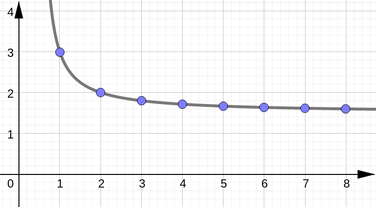
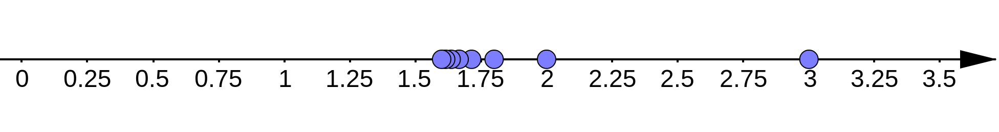

# (S-1) Sequences

In this lesson we are going to introduce the definition of a sequence, look at the different types of notation, and see how to visualize a sequence graphically. 


By the end of this lesson, you will be able to write out the first few terms of a sequence given the general term $a_n$.


---


## Definition of a Sequence


```{admonition} Sequence
A **sequence** is a function with the set of positive integers as its domain.

```

We tend to think of a sequence as an infinite list:

$$
\bigg\{a_1, \; a_2, \; a_3, \, \dots , \, a_n, \, \dots\bigg\}
$$

where all of the terms of the sequence are written in a specific order. Relating this to function notation, we could also say $f(n)=a_n$. Where the $n$th term of our sequence is equal to the function evaluated at number $n$.


## Notation

We usually describe a sequence with a few different notations:


Writing out the first few terms:

$$
\bigg\{a_1, a_2, a_3, \dots  \bigg\}
$$

Writing out the formula for the $n$th general term:

```{math}
\bigg\{a_n  \bigg\}_{n=1}^{\infty}
```


---


## Example 1


List the first **four terms** of the sequence:

```{math}
\left\{ \dfrac{3n}{2n-1}\right\}_{n=1}^{\infty}
```

````{dropdown} Solution (Click to see the steps.)

```{tabbed} Step 1
We notice that the $n$-values start with $n=1$. To find the first four terms of the sequence, we will plug $n=1$, $n=2$, $n=3$, and $n=4$ into the formula of the general term:

$$
a_n=\dfrac{3n}{2n-1}
$$

```

```{tabbed} Step 2

Let's calculate these:

$$
n=1 & \quad \longrightarrow \quad & \dfrac{3(1)}{2(1)-1} = \dfrac{3}{1} = 3\\[10pt]
n=2 & \quad \longrightarrow \quad & \dfrac{3(2)}{2(2)-1} = \dfrac{6}{3} = 2\\[10pt]
n=3 & \quad \longrightarrow \quad & \dfrac{3(3)}{2(3)-1} = \dfrac{9}{5} \\[10pt]
n=4 & \quad \longrightarrow \quad & \dfrac{3(4)}{2(4)-1} = \dfrac{12}{7}\\[10pt]
$$

```

```{tabbed} Step 3

Finally we write out the first four terms of our sequence:

$$
\bigg\{ 3, 2, \tfrac{9}{5}, \tfrac{12}{7} , \dots \bigg\}
$$

```


````

---

## Starting Index Value

```{admonition} Starting Index Value
We can generalize the idea of sequences so that our index $n$ starts at values other than $n=1$. 

```


## Example 2


List the first **four terms** of the sequence:

```{math}
\bigg\{ (-1)^n (n+1) \bigg\}_{n=3}^{\infty}
```


````{dropdown} Solution (Click to see the steps.)

```{tabbed} Step 1
We notice that the $n$-values start with $n=3$. To find the first four terms of the sequence, we will plug $n=3$, $n=4$, $n=5$, and $n=6$ into the formula of the general term:

$$
a_n=(-1)^n (n+1)
$$

```

```{tabbed} Step 2

Let's calculate these:

$$
n=3 & \quad \longrightarrow \quad & (-1)^3 (3+1) = -4\\[10pt]
n=4 & \quad \longrightarrow \quad & (-1)^4 (4+1) = 5\\[10pt]
n=5 & \quad \longrightarrow \quad & (-1)^5 (5+1) = -6 \\[10pt]
n=6 & \quad \longrightarrow \quad & (-1)^6 (6+1) = 7\\[10pt]
$$

```

```{tabbed} Step 3

Finally we write out the first four terms of our sequence:

$$
\bigg\{ -4, 5, -6, 7 , \dots \bigg\}
$$

```


````

---


```{admonition} Factorials
$$
n! = n\cdot(n-1)\cdot \cdots \cdot 3\cdot 2 \cdot 1
$$

```


## Example 3


List the first **four terms** of the sequence:

```{math}
\bigg\{ \dfrac{2^n}{n!} \bigg\}_{n=0}^{\infty}
```


````{dropdown} Solution (Click to see the steps.)

```{tabbed} Step 1
We notice that the $n$-values start with $n=0$. To find the first four terms of the sequence, we will plug $n=0$, $n=1$, $n=2$, and $n=3$ into the formula of the general term:

$$
a_n=\dfrac{2^n}{n!}
$$

```

```{tabbed} Step 2

Let's calculate these:

$$
n=0 & \quad \longrightarrow \quad & \dfrac{2^0}{0!} = 1\\[10pt]
n=1 & \quad \longrightarrow \quad & \dfrac{2^1}{1!} = 2\\[10pt]
n=2 & \quad \longrightarrow \quad & \dfrac{2^2}{2!} = 2\\[10pt]
n=3 & \quad \longrightarrow \quad & \dfrac{2^3}{3!} = \tfrac{4}{3}\\[10pt]
$$

```

```{tabbed} Step 3

Finally we write out the first four terms of our sequence:

$$
\bigg\{ 1, 2, 3, \tfrac{4}{3} , \dots \bigg\}
$$

```


````


## Example 4

Find a formula for the general term $a_n$ of the following sequence. Suppose that the sequence starts with index $n=1$.

```{math}
\bigg\{ -\dfrac{3}{4}, \dfrac{9}{5}, -\dfrac{27}{6}, \dfrac{81}{7} , \dots \bigg\}
```


````{dropdown} Solution (Click to see the steps.)

```{tabbed} Step 1
We begin by noticing the alternating $\quad - \quad + \quad - \quad + \quad $ pattern. How do we achieve this? Usually with either: 

$$
(-1)^{n-1} \quad \text{or} \quad (-1)^n \quad \text{or} \quad (-1)^{n+1}
$$

Since our index starts at $n=1$, we see that only one of these works:

$$
&(-1)^{n-1} \quad &\longrightarrow \qquad + \quad - \quad + \quad -\\[10pt]
&(-1)^{n} \quad &\longrightarrow \qquad - \quad + \quad - \quad +\\[10pt]
&(-1)^{n+1} \quad &\longrightarrow \qquad + \quad - \quad + \quad -\\[10pt]
$$

So we will use $(-1)^n$ in our final answer.


```

```{tabbed} Step 2

Next let's look at the numerator. And to help with this let's write out the index number that corresponds with each term:

| Index | 1 | 2 | 3 | 4 |
|:-----:|:-:|:-:|:-:|:-:|
| Numerator | $3$ | $9$ | $27$ | $81$ |

To make this even more useful let's try to factor each term in the numerator:

| Index | 1 | 2 | 3 | 4 |
|:-----:|:-:|:-:|:-:|:-:|
| Numerator | $3$ | $3^2$ | $3^4$ | $3^4$ |

We see that in the:
- first term we have one copy of $3$
- second term we have two copies of $3$
- third term we have three copies of $3$

So we conclude that the $n$th term would have $n$ multiples of $3$ or more specifically $3^n$.


```

```{tabbed} Step 3

We also want to consider the denominator. Again, let's write out the index number that corresponds with each term:

| Index | 1 | 2 | 3 | 4 |
|:-----:|:-:|:-:|:-:|:-:|
| Denominator | $4$ | $5$ | $6$ | $7$ |

We see that the denominator in the
- first term is 3 more than index 1: $\quad 4=3+1$
- second term is 3 more than index 2: $\quad 5=3+2$
- third term is 3 more than index 3: $\quad 6=3+3$

So we conclude that the $n$th term would be 3 more than index $n$ or more specifically: $3+n$.

```

```{tabbed} Conclusion

So far we have found that:

- the $-+-+$ pattern gives us $(-1)^n$
- the numerator would have $3^n$
- the denominator would have $n+3$.

Putting this all together, we get:

$$
a_n = (-1)^n\cdot \dfrac{3^n}{n+3}
$$

```


````


## Graphical Representation

Sometimes it helps to have a visual depiction of a sequence.

### Plot on the Cartesian Plane


Plot the points $(n,a_n)$ on the usual $xy$-plane:



### Plot on the Number Line

Plot each term of the sequence $a_n$ on the number line:


